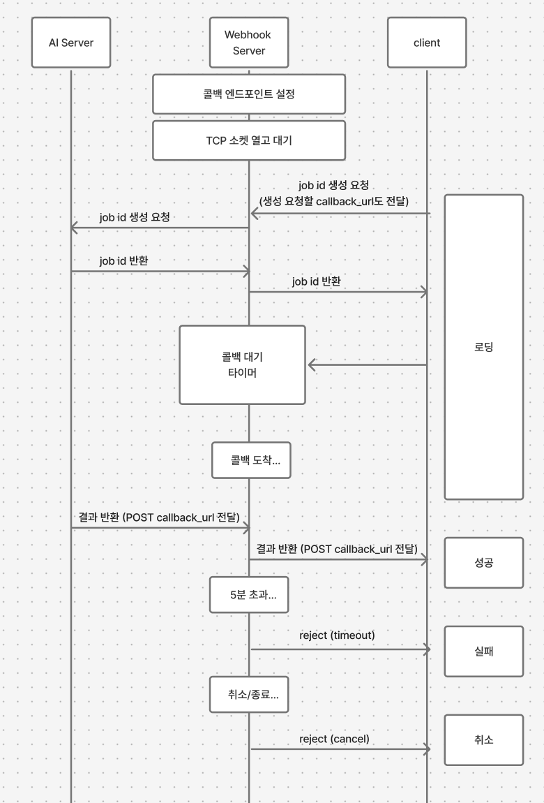

import Callout from '@/components/Callout.astro'

AI 이미지 생성 서비스의 프론트엔드를 1년 4개월 동안 혼자 개발하면서, 서버에서 생성된 AI 이미지를 가져오는 과정이 느리거나 일정하지 않은 문제를 겪었습니다.

콜드스타트 시에는 더 느려지고, 이후에도 응답 속도가 제각각이라 프론트엔드에서 API 호출을 점진적으로 가져오는 대응이 필요했습니다.

---

## 초기 접근: 클라이언트 폴링

초반에는 클라이언트에서 주기적 타이머(폴링)로 AI 이미지 상태 리스트를 조회했습니다.

하지만 한 화면에 여러 작업 상태를 리스트 단위로, 짧은 주기로 갱신하다 보니 API 요청 수가 급격히 증가했습니다. 잦은 캐시 갱신과 리렌더링으로 인해 UX 안정성이 떨어지는 문제가 발생했고, 결국 클라이언트 폴링은 현재 구조상 적합하지 않다고 판단했습니다.

---

## 대안 검토: 웹소켓 vs 서버 폴링

대안을 검토했을 때 웹소켓과 서버 폴링이 있었습니다.

웹소켓은 기술적으로 가장 깔끔한 해법이어서 백엔드 개발자와 논의를 했지만, 조직 내에서 아래 사항들을 고려하면 과한 선택이었습니다.

- 서버 프로토콜 변경 필요 (백엔드 개발자 리소스 부담)
- 장애 시 대응 비용 증가

이후 서버 개발 의존도를 줄이면서도 안정적으로 구현 가능한 방법을 찾다가, Next.js API Routes를 이용한 서버 폴링을 알게 되었습니다.

Next.js API Routes를 프록시 서버로 사용해 기존 서버 API를 감싸고, 클라이언트 요청을 대리 처리하는 방식으로 구현했습니다.

---

## 서버 폴링의 한계

프론트엔드 렌더링 부하를 줄이고, 클라이언트 쿼리 로직을 단순화할 수 있었지만 동시에 다음과 같은 문제가 드러났습니다.

<Callout title="서버 폴링의 문제점" variant="warning">
- **불필요한 API 호출 문제** (클라이언트 폴링도 동일)
- **폴링 상태 관리 로직 추가 부담** (타임아웃, retry, 디버깅 체크가 많아 상태가 꼬일 수 있음)
- **응답 지연 문제** (예: 3초 주기 폴링에서 3.5초에 AI 이미지가 완료되면, 이후 3초를 더 기다려야 함)
</Callout>

```jsx
async waitCompletionPolling(
    jobId: number,
    interval: number = 3000,
    timeout: number = 300000,
  ): Promise<GetJobDetail.Response> {
    const startTime = Date.now()
    this.pollingCancelled.set(jobId, false)

    try {
      while (!this.pollingCancelled.get(jobId)) {
        // 타임아웃 체크
        if (Date.now() - startTime > timeout) {
          throw new Error(`Polling timeout: ${timeout}ms`)
        }

        const job = await this.getJobDetail(jobId)

        // 상태별 분기
        switch (job.status) {
          case 'succeeded':
            return job
          case 'failed':
            throw new Error(`Job failed: ${job.error_message}`)
          case 'cancelled':
            throw new Error('Job cancelled')
          default:
            // queued, running → 다음 폴링 대기
            await this.sleep(interval)
        }
      }

      // 외부에서 취소된 경우
      throw new Error(`Polling cancelled for job ${jobId}`)
    } finally {
      this.pollingCancelled.delete(jobId)
    }
  }
```

---

## 웹훅이라는 선택지

웹소켓만 생각했지, 기본적으로 사용하던 웹훅 기법을 적용할 거라고는 생각하지 못했습니다. 하지만 웹훅이 가장 적절한 방법이라고 느꼈습니다.

<Callout title="웹훅을 선택한 이유" variant="note">
- 서버가 완료 시점에 한 번만 알려주면 됨 → **불필요한 API 호출 제거**
- 기존 HTTP 인프라 그대로 사용 가능 → **웹소켓처럼 프로토콜 변경 불필요**
- 서버사이드로 웹훅 엔드포인트 구현 가능한 구조
</Callout>

웹훅을 공부하며 깨달은 가장 중요한 사실은, **HTTP 요청은 브라우저만 보내는 게 아니라 서버도 다른 서버에 보낼 수 있다**는 것이었습니다.

그동안 프론트엔드 개발만 하다 보니 요청은 브라우저 → 서버 방향만 생각했는데, 서버 → 서버 (또는 서버 → 나) 방향도 가능하다는 것을 다시 한번 깨닫게 되었습니다.

---

## 로컬 환경에서 웹훅이 오지 않는 이유

웹훅을 테스트하면서 로컬 환경에서는 웹훅이 도착하지 않는 문제를 겪었습니다.

외부 AI 서버는 공인 IP만 인식하지만, 로컬 PC는 사설 IP를 사용합니다. 공유기의 NAT가 외부에서 들어오는 요청을 차단하기 때문에 **포트 포워딩**이 필요합니다. 혹은 같은 네트워크 안에서 작업을 해야 웹훅을 받을 수 있습니다.


---

## 웹훅의 흐름



### 비동기 콜백 제어

웹훅이 도착하면 대기 중인 Promise를 찾아 타이머를 clear하고, 대기 중이었던 job을 삭제한 후 결과를 반환합니다.

이때 메모리 누수와 중복을 방지하기 위해 `Map`에서 데이터를 반드시 삭제해야 합니다. 실패 및 취소 시에도 job_id를 삭제해야 합니다.

```jsx
onWebhookReceived(payload) {
  const task = waitingTasks.get(payload.job_id);
  if (task) {
    clearTimeout(task.timerId); // 웹훅 수신 시 타임아웃 타이머 해제
    waitingTasks.delete(payload.job_id); // 메모리 정리
    task.resolve(payload); // 대기 중인 요청 완료
  }
}
```

<Callout title="서버리스 환경의 한계" variant="warning">
서버리스 환경에서는 인스턴스 수명 문제로 한계가 있습니다. 실행 시간 제한과 콜드 스타트로 인해 웹훅 처리 자체가 중간에 종료될 수 있어, **작업 실패**와 **전달 실패**를 명확히 구분하기 어렵습니다.

예를 들어, webhook server가 강제 종료 타임아웃 에러가 났을 때 (AI 서버는 상태가 완료일 경우) 어떤 에러인지 파악이 어려울 수 있습니다. 실제로 몇 초까지 실행되었는지, 네트워크 지연 때문인지, AI 서버가 상태를 특정하기 전에 죽은 건지 정확한 시점을 파악하기 어렵습니다.

참고: [Vercel Functions Limitations](https://vercel.com/docs/functions/limitations) (기본 5분 이후 타임아웃 504 에러)
</Callout>

---

## 이중 안전장치: 웹훅 + 폴링 Fallback

웹훅은 효율적이지만 100% 도착을 보장하지 않습니다. 네트워크 유실 문제를 대비해 **웹훅 우선 수신 + 폴링 Fallback** 구조를 설계하는 것이 좋습니다.

```jsx
async function waitJobCompletion(jobId, options = {}) {
  // 1단계: 웹훅 수신 시도
  try {
    return await waitForWebhook(jobId, options.timeout);
  } catch (error) {
    // 2단계: 실패 시 폴링으로 자동 전환
    console.warn(`[Job:${jobId}] 웹훅 실패, 폴링으로 전환`);

    return await startPolling(jobId, options);
  }
}
```

---

## 마무리

AI 웹 서비스를 1년 넘게 만져보면서, 서버를 알지 않으면 알 수 없는 것들도 있다는 걸 처음 느끼게 해준 주제였습니다.

기존에는 많은 문제들을 프론트엔드에서 제어해야 할 상태로 보고 해결이 가능하겠다고 생각했었지만 웹훅을 공부하면서 **이 문제의 주도권은 완료 시점을 알고 있는 서버에 있다**는 것을 깨달았고, 정보를 가지고 있는 쪽이 상태를 관리하는 게 더 안정적이라는 것도 함께 배웠습니다.

또한 완벽한 답은 없으니, 여러 상황을 파악한 후 방법을 채택하는 게 맞다는 생각이 들었습니다.

네트워크를 조금이라도 이해할 때, 비로소 프론트엔드 개발자도 더 효율적인 시스템을 만들 수 있다는 것을 실무를 통해 알게 되었고, 백엔드와 프론트엔드를 나눌 것 없이 같이 이해하는 게 중요하다는 말이 이런 의미였다는 것을 깨닫게 되었습니다.
